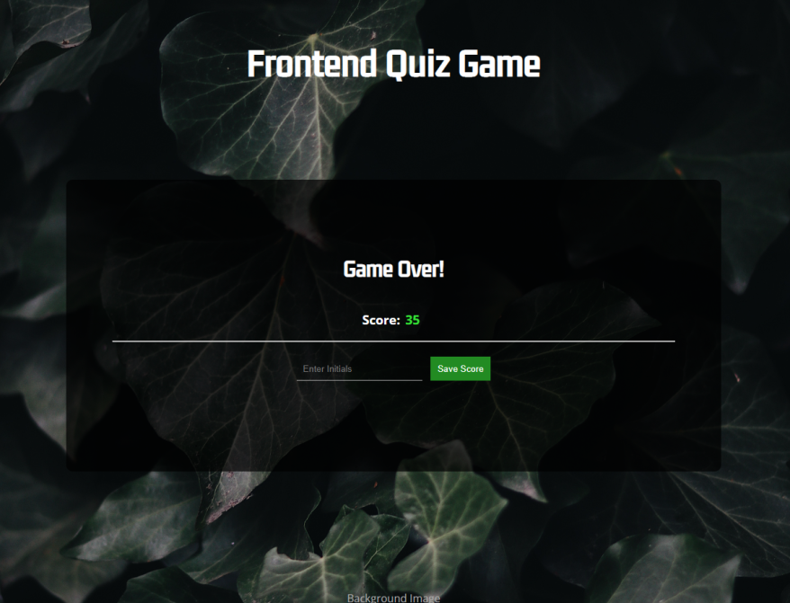
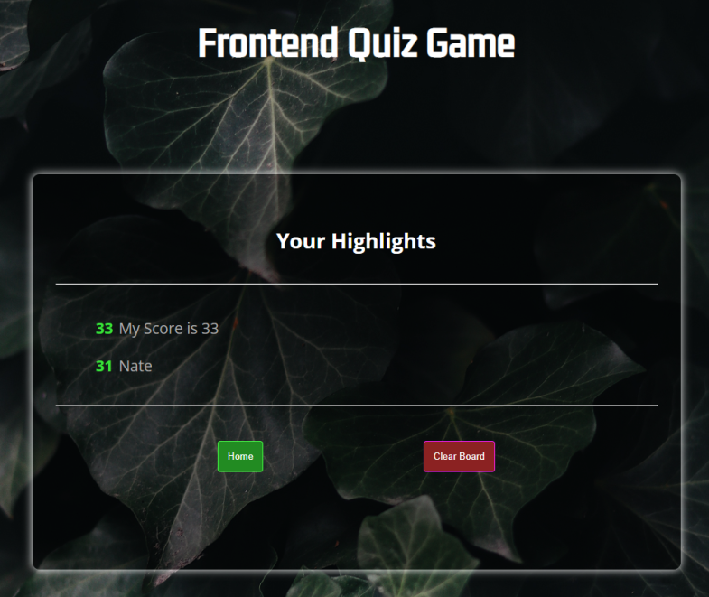

# Quiz Game

6/15/22

A timed quiz that allows users to test their frontend knowledge! While playing, a timer is set and score is being tracked, and when a user chooses an answer, the choice's background will change from red/green based on if they were right or wrong and will also display right/wrong on the bottom of the card. When the game has ended, another screen will appear which will also allow the user to save their score by adding their initials and clicking the save button. Their score will be added to the list in another card that will also show it's previous saved scores.

## Deployed Website
- https://tdgnate.github.io/Quiz-Code

## Overview

